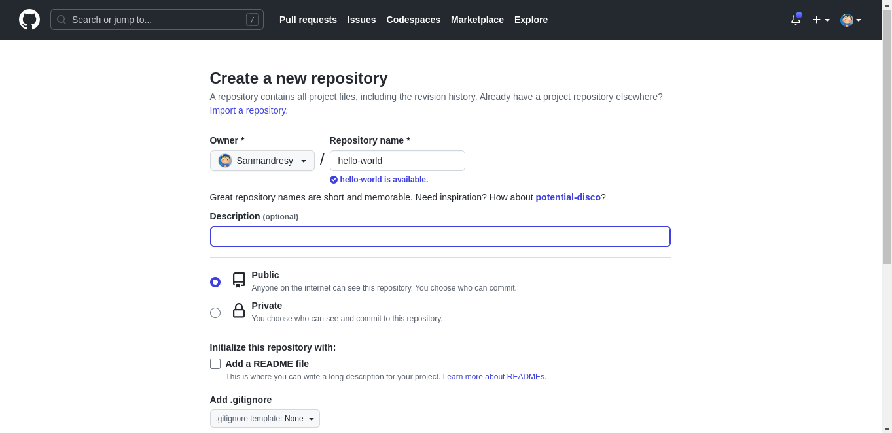
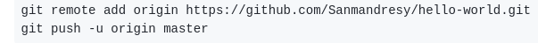

# Git Started
## Learn Git with fun

We're gonna learn Git with a simple example so let's git started (haha 😃).
What is required for this kata ?

>Git installed on your computer/laptop

## Linux/Mac
Make sure that git is already installed altough it should be the case.
For Debian/Ubuntu distro, you can use this command to install git:

```bash
sudo apt install git
```

## Windows
You can download the installer from their website [git](https://git-scm.com/download/win) and just install it.

## Let's begin

1) Create a folder named **git-started**.
2) Open Git Bash (**Windows**) / a terminal (**Linux**) inside the folder.
3) We're gonna init a repository locally with this command:

```bash
git init 
```

4) The default branch is named **main** or **master**. We're gonna rename it to **dev**.
```bash
git branch -m dev
```

5) Create a file named **hello_world.txt** with this command:
```bash
echo "console.log("Hello World");" > hello_world.txt 
```
>Alternatively you can use your favorite text editor.

6) Now we're gonna track this file so it can be saved:
```bash
git add hello_world.txt
```

7) Then we're gonna save the changes we made (*creating this file and putting content inside*):
```bash
git commit -m "chore: display hello world with js" 
```

## Push

1) Now create a repository named **hello-world** on Github.



> Make sure to choose public and nothing else after.

2) To link the your local repository to your remote repository copy these two links:


> Make sure to use yours 'cause it is different for users and change the branch to dev

3) Your local repository is now linked to your repository on Github.