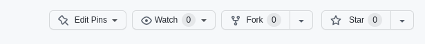
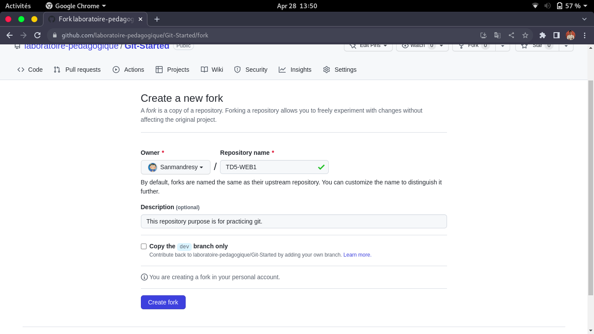
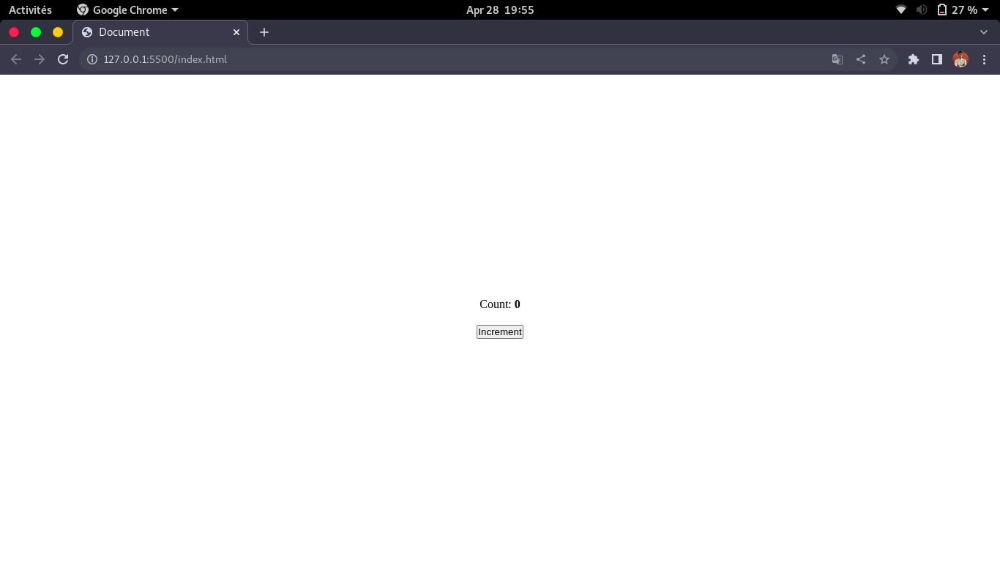
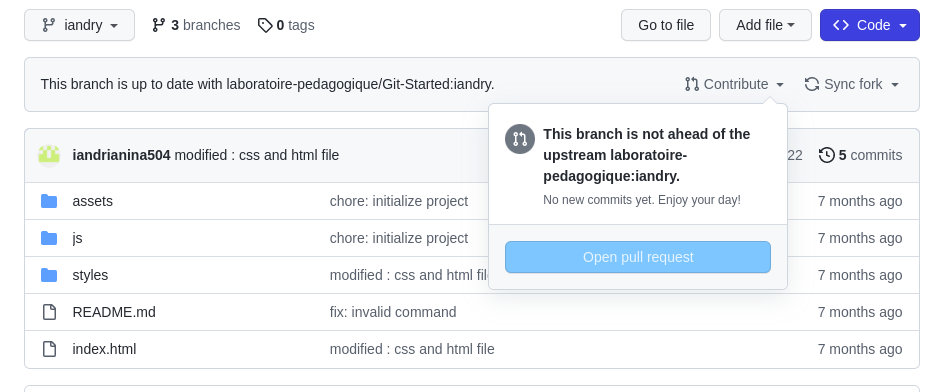
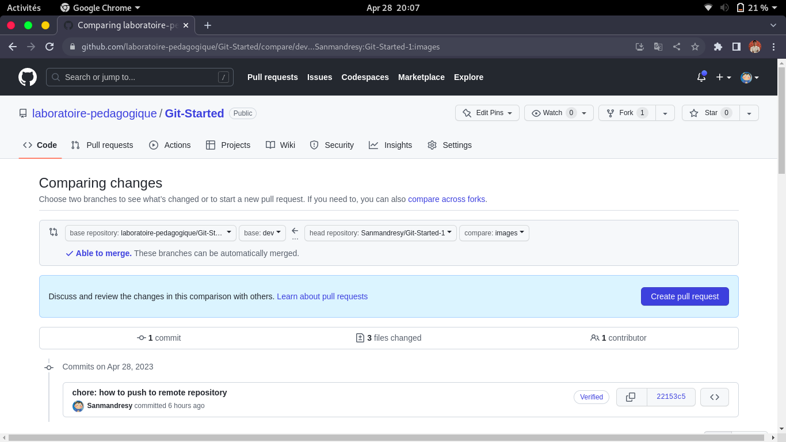

# TD5 - WEB1

## Prerequisites

Make sure to read and try everything in the [readme](https://github.com/laboratoire-pedagogique/Git-Started/blob/dev/readme.md) in the branch **dev**.

1)Fork this repository by clicking on the **fork** button shown here:

2)You'll be redirected here:

1) Fork name : **TD5-WEB1**
2) Uncheck the "*copy the **dev** branch only*".

3)Now we're good to go !

## Incremental Button

1)You are gonna create a button that will increment a count everytime we click on it.

2)Try to reproduce the display shown below:

3)When you're done don't forget to save your changes and push them to your "forked" repository.

4)Now open a pull request on the Git-Started repository:

1/Open your repository and choose your branch and click on **Contribute**:

2/Click on **Open pull request**.

3/You'll be redirected to this page:

>The base branch should be **td5** and the compare should be your **student's reference** like *STD2201*.

4/Just click on **Create pull request**.

5/That's it!
